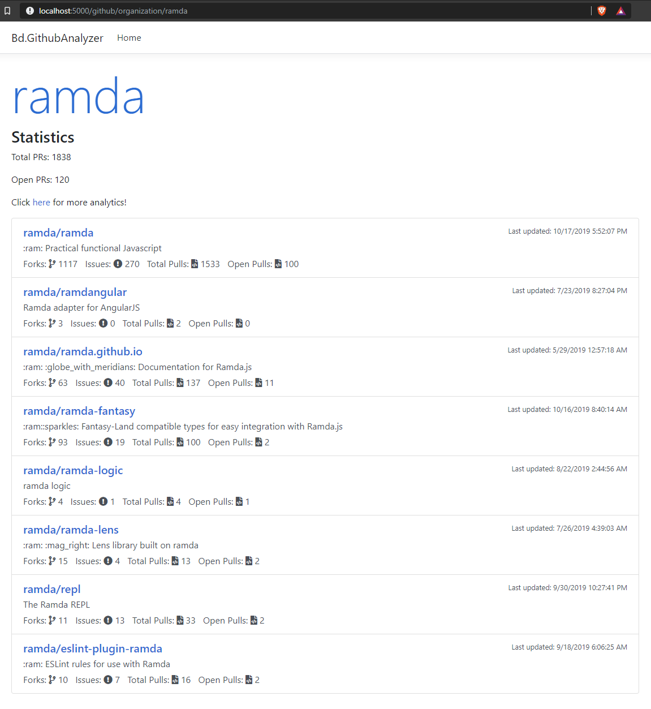

# github-analyzer

## Project Layout

The solution consists of 3 projects:
* Bd.GithubAnalyzer
    * Contains the root of the solution, a .NETCore 3 web application
* Bd.GithubAnalyzer.Data
    * Contains two important classes: 
        * GithubService: The service that wraps a webclient for connecting with the Github API
        * GithubRepository: A caching layer that wraps the GithubService, and combines some service calls together
* Bd.GithubAnalyzer.Data.Tests
    * Unit tests around GithubService and GithubRepository

## Configuration

There are only two configuration values that need to be set. The file to set them in is located under the **Bd.GithubAnalyzer** project: appsettings.json.

1. GithubApiUrlBase: The base URL for the Github API
2. GithubApiOAuthToken: A Github Personal Access token, for authenticating with the API. Can be generated here: https://github.com/settings/tokens

## Prerequists

Since this a .NETCore 3 project, youll need the .NETCore 3 SDK, which can be found here: https://dotnet.microsoft.com/download/dotnet-core/3.0

## Building and Running

From the root directory of the project:

To restore the nuget packages for the project:
```
$ dotnet restore
```

To build the project DLLs
```
$ dotnet build
```

To run the web server application
```
$ dotnet run --project Bd.GithubAnalyzer
```

This should run the application on port 5000, although, you can check the command line window to verify what port its running on. 

Example startup log:
```
bobby@BOB-RYZEN MINGW64 ~/dev/github-analyzer
$ dotnet run --project Bd.GithubAnalyzer
info: Microsoft.AspNetCore.DataProtection.KeyManagement.XmlKeyManager[0]
      User profile is available. Using 'C:\Users\bobby\AppData\Local\ASP.NET\DataProtection-Keys' as key repository and Windows DPAPI to encrypt keys at rest.
info: Microsoft.Hosting.Lifetime[0]
      Now listening on: http://localhost:5000
info: Microsoft.Hosting.Lifetime[0]
      Application started. Press Ctrl+C to shut down.
info: Microsoft.Hosting.Lifetime[0]
      Hosting environment: Development
info: Microsoft.Hosting.Lifetime[0]
      Content root path: C:\Users\bobby\dev\github-analyzer\Bd.GithubAnalyzer
```

### Web Application

Upon navigating to the URL after startup, youll be greeted by a welcome page. This welcome page will allow you put in a github organization, to do a lookup on. This process can be slow (25+ seconds for 'ramda'!), since it will execute multiple web requests against the Github API to retrieve all the Pull Request information.

#### Result Screen

Upon a successful lookup, youll be navigated to a simple results page, that will display all the repositories for the organization, and some metadata about them:



#### Analytics Screen

By clicking on the link for more analytics, youll be redirected to the analytics page:


